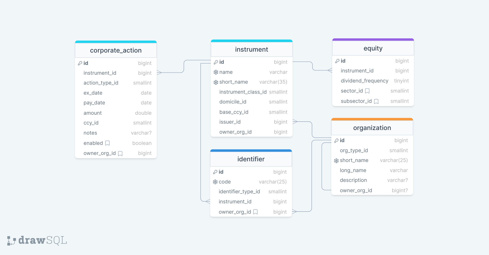

# How To Quant (backend)

This is a **proof of concept** hobby project aimed at exploration of finance topics and their technical implementation. While the functionality and architecture bares some resemblance to real-world systems and some of the data reflects true facts, no part of this project is intended as financial advice and is not to be considered as such.

The deployed API can be accessed on root https://howtoquant.pythonanywhere.com/\<appname>/ with available endpoints documented [here](https://github.com/VikSil/howtoquant-backend/blob/trunk/howtoquant/assets/json/all_endpoints.json).

The front-end is deployed to [howtoquant.com](https://howtoquant.com).

The front-end repository is available [here](https://github.com/VikSil/howtoquant-frontend).

## Table of contents

<ol>
<li><a href = "#project-structure">Project structure</a></li>
<li><a href = "#data-model">Data model</a></li>
<li><a href = "#running-locally">Running locally</a></li>
<li><a href = "#past-sprints">Past sprints</a></li>
<li><a href = "#roadmap">Roadmap</a></li>
</ol>

## Project structure

The project is built with Django framework, providing a set JSON API endpoints for retrieving and inserting data into MySQL database. The functionality is divided into apps (modules) as follows:

* __Classifiers app__ - stores standartised re-usable data units representing sets of objects shared by other apps. The datasets are provided in SQL seed script for this app and canot be changed by the user.
* __Staticdata app__ - stores information that is expected to rarely change and have infrequent additions once a mature dataset is established. By convention "static data" in finance is used in reference to instrument details/contract setup. This app also includes organizations that can be referenced by other entities and apps, such as funds, prime brokers, issuers and 3rd parties. This app provides functionality for requesting instrument data (equity only) from 3rd party API (Yahoo Finanace) and manual instrument setup.
* __Marketdata app__ - stores data that is produced as a byproduct of market activity/transactions, i.e. prices, fxrates, interest rates, and other numerical data (colloquially referred to as "analytics"). This app provides functionality for price data download from 3rd party API (polygon.io) and saving the data for permanent storage.
* __Accounting app__ - stores data pertaining to organization portfolio and trading activity, including book, strategy and account setup, trade log, cash and non-cash asset ladders.


## Data model

Data is organised in Django ORM as per ER diagrams below. Each image features only the models contained within the app, relationships between apps are inferred by field names matching table names in another app. 

### Classifiers app

[](howtoquant/assets/ER_diagrams/Classifiers_v.1.0.1.png)

### Staticdata app
[](howtoquant/assets/ER_diagrams/Static_data_v1.0.2.png)

### Marketdata app
[](howtoquant/assets/ER_diagrams/Market_data_v1.0.png)


### Accounting app
[](howtoquant/assets/ER_diagrams/Accounting_v.0.3.png)

## Running locally

### Requirements and dependencies

#### Hardware requirements:
* Network card and internet connection.
* Processor and RAM requirements depend on the browser/API client of your choice, and whether MySQL database is hosted locally or remotelly. Requirements for MySQL can be found [here](https://dev.mysql.com/doc/mysql-monitor/8.0/en/system-prereqs-reference.html).
* Storage space of at least 360 MB (with local database), although 500 MB is recommended.

#### Software dependencies:
* Git.
* Python and pip - the project was developed using Python 3.11, earlier versions may work, but have not been tested.
* MySQL database either locally or remotely hosted - [aiven](https://aiven.io/) hosting service was used for development.
* Browser or API client of your choice.

#### Third party dependencies:
* API key to use polygon.io data

### Setting up the project

Follow these steps to set up the project on a local machine:

1. Create a directory where the project will be contained and [git clone](https://git-scm.com/docs/git-clone) this repository. 
1. In console navigate to the root directory of the project (where manage.py file is located). Alternativelly, you may want to create a [virtual environment](https://developer.mozilla.org/en-US/docs/Learn/Server-side/Django/development_environment#using_django_inside_a_python_virtual_environment).
1. Run `pip install -r requirements.txt` to install all pythonic dependencies (this will take several minutes to complete). 
1. In project folder `howtoquant` add ./.envs/.env_dev file with environemnt variables like this:
```
ENVIRONMENT=development

DB_ENGINE=django.db.backends.mysql
DB_NAME=YOUR_DATABASE_NAME_HERE
DB_USER=YOUR_DATABASE_USERNAME_HERE
DB_PASSWORD=YOUR_DATABASE_PASSWORD_HERE
DB_HOST=YOUR_DATABASE_HOST_HERE
DB_PORT=14300

POLYGON_API_KEY=YOUR_POLYGON_API_KEY_HERE

SECRET_KEY=ANY_RANDOM_SEQUENCE_OF_CHARACTERS
```
5. From the command line run command `python manage.py migrate` - this will create tables in the database.
1. Run in sql script located in project folder `howtoquant/db/reseed_db.sql`. The exact procedure of executing this script will vary depending on your databse hosting solution and the database manager of your choice. If you are hosting the database locally and accessing it via MySQL Workbench, use _File-->Run SQL Scripts_ command, choose your db schema name and _utf8_ as the default character set.  

1. You should be ready to start the server

### Starting the server and accessing endpoints

To start the server execute this command `python manage.py runserver`. If successful, you should see a line `Starting development server at http://127.0.0.1:8000/` amongst the output.

The website will now be available on the localhost. Input the following url in the browser/APi client to access documentation listing all endpoint: `http://127.0.0.1:8000/api`. Other endpoints will be accessible on `http://127.0.0.1:8000/<appname>/<endpoint>`

## Past sprints

Code and release notes of each of the past releases can be found in the respective branch of this repo, as per table below.

<table>
    <thead>
        <tr>
            <th>Sprint No.</th>
            <th>Relase notes</th>
        </tr>
    </thead>
    <tbody>
        <tr>
            <td align = "center">#1</td>
            <td><a href = "https://github.com/VikSil/howtoquant-backend/tree/v.0.1.0-alpha">v.0.1.0-alpha</a></td>
        </tr>
        <tr>
            <td align = "center">#2</td>
            <td><a href = "https://github.com/VikSil/howtoquant-backend/tree/v.0.2.0">v.0.2.0</a></td>
        </tr>
    </tbody>
</table>

## Roadmap

The trajectory of this project is bound to change in accordance to time constraints, priorities and interests of the author. A rough plan for near future sprints is as follows:

<table>
    <thead>
        <tr>
            <th>Sprint No.</th>
            <th align = "center">Tasks</th>
        </tr>
    </thead>
    <tbody>
        <tr>
            <td align = "center">#3</td>
            <td><ul>
            <li>Add POST and GET endpoints for trade data</li>
            <li>Establish new trade data flow through accounting model tables (cumulative qty only)</li>
            <li>Add rollower functionality</li>
            </ul></td>
        </tr>
        <tr>
            <td align = "center">#4</td>
            <td><ul>
            <li>Add portfolio data seed</li>
            <li>Add MV calculation to trade processing</li>
            <li>Add PnL calculation to trade processing</li>
            </ul></td>
        </tr>
        <tr>
            <td align = "center">#5</td>
            <td><ul>
            <li>Add message queue for process control and coordination</li>
            <li>Implement unused market data download trunkation</li>
            </ul></td>
        </tr>
        <tr>
            <td align = "center">#6</td>
            <td><ul>
            <li>Port least efficient functionality to Rust</li>
            <li>Add user management</li>
            </ul></td>
        </tr>
        <tr>
            <td align = "center">#7</td>
            <td><ul>
            <li>Add VaR functionality</li>
            </ul></td>
        </tr>
        <tr>
            <td align = "center">...</td>
            <td><ul>
            ...
            </ul></td>
        </tr>
    </tbody>
</table>

## License

The source code and all artifacts are awailable under [CC BY-NC-SA 4.0 DEED](https://creativecommons.org/licenses/by-nc-sa/4.0/) terms. 